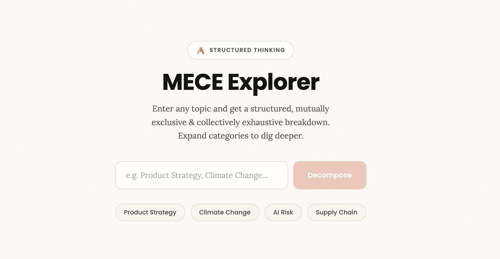
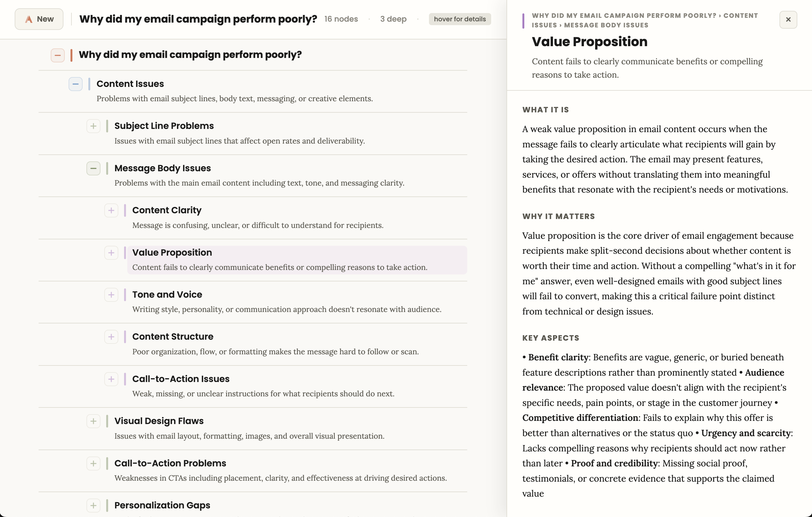

# MECE Explorer

An AI-powered structured-thinking tool that decomposes any topic into mutually exclusive, collectively exhaustive categories — and lets you keep drilling deeper.



Enter a topic. Claude breaks it into 3–6 MECE categories. Click **+** on any category to decompose it further. Click any category label to open a side panel with a detailed, on-demand explanation generated for that node in its full path context. No limit on depth — the model self-regulates via confidence signals and terminal-leaf markers.



## Why It's Useful

Most of the hard work in thinking clearly isn't generating ideas — it's *carving the space up* so you can tell what's missing, what's overlapping, and what deserves attention. MECE Explorer turns that carving into a fast, visual, AI-assisted loop.

Concrete ways people use it:

- **Scoping a new problem.** Before writing a strategy doc, PRD, or research plan, decompose the topic two or three levels deep to see the shape of the space. You'll spot gaps and priors you didn't know you had.
- **Due diligence and learning a new domain.** Given an unfamiliar topic (e.g. "industrial heat pumps," "fraud in embedded finance"), produce a structured outline of the sub-areas and then click into any node for a targeted explainer — a faster path than a blank-page search.
- **Competitive or market analysis.** Break "players in X market" by segment, geography, business model, and price tier in parallel trees and compare how the space looks through each lens.
- **Interview and workshop prep.** Generate an issue tree for a case or discovery session in seconds, then use the detail panel to go deeper on specific branches as the conversation evolves.
- **Writing and teaching.** Use the tree as a skeleton outline; the per-node explanations give you a head start on section-level prose.
- **Product and feature discovery.** Decompose "failure modes of our checkout flow" or "reasons users churn" to generate hypotheses that are mutually exclusive — so every branch you investigate is tracking a genuinely distinct cause.

The tool's value comes from the combination of **structure** (MECE discipline prevents sloppy or overlapping categories), **depth on demand** (you only pay model cost for the branches you care about), and **context preservation** (the full ancestry path is sent on every expansion, so deep nodes stay coherent with the root topic).

## Features

- **Interactive tree expansion** — Categories render as an indented tree. Each node shows its label plus a one-line description inline. Click **+** to go deeper, **−** to collapse. No re-fetch on toggle.
- **Detail side panel** — Click any category to slide in a right-hand panel with a longer, structured explanation (what it is, why it matters, key aspects, examples). Explanations are cached per node. The tree shifts left on wide screens so both remain usable side-by-side; Esc or × closes it.
- **Confidence signaling** — Every decomposition returns a confidence level (high, medium, low). Medium and low trigger a dismissible banner with the model's reasoning about potential overlap or forced splits.
- **Terminal leaf detection** — Categories too atomic to decompose further are marked with a leaf indicator instead of a **+** button, preventing dead-end expansions.
- **Context-aware depth** — Each expansion sends the full ancestry path to the model, so sub-categories remain coherent with the root topic.

## Architecture

```
User clicks [+] on a category
  → Server route sends the full path (Root → Parent → This Category) to Claude
  → Claude returns 3-6 sub-categories + confidence metadata
  → App inserts child rows into the tree
  → Repeat
```

Parallel flow for detail panel:

```
User clicks a category label
  → Server route asks Claude for a structured explanation
  → Panel renders markdown response (headings, bullets, emphasis)
  → Result is cached in-store for instant reopening
```

## Tech Stack

- **Next.js 14** (App Router) — server-side API routes keep the API key off the client
- **TypeScript** end-to-end
- **Tailwind CSS** + inline styles for component-local design tokens
- **Zustand** for flat tree state (nodes, expansion, selection, cached explanations)
- **Claude SDK** on the server (Sonnet model) for decomposition and explanation

## Project Structure

```
mece-explorer/
├── app/
│   ├── layout.tsx              # Root layout, fonts, metadata
│   ├── page.tsx                # Start screen ↔ tree view switch
│   └── api/
│       ├── decompose/route.ts  # POST → MECE categories for a path
│       └── explain/route.ts    # POST → detailed explanation for a node
├── components/
│   ├── StartScreen.tsx         # Topic input, example chips
│   ├── TreeView.tsx            # Sticky header + table + detail panel mount
│   ├── TreeRow.tsx             # Recursive row (core component)
│   ├── DetailPanel.tsx         # Right-side explanation panel + markdown renderer
│   ├── ConfidenceBanner.tsx    # Medium/low confidence sub-row
│   └── ui/                     # Primitives: PlusMinusButton, LeafDot, LoadingDots, LeafBadge
├── store/
│   └── useTreeStore.ts         # Zustand store (tree + selection + explanations)
├── lib/
│   ├── types.ts                # MECENode, DecomposeResponse, depth color helpers
│   ├── prompts.ts              # System prompt for decomposition
│   ├── api.ts                  # Client-side fetch wrappers
│   └── export.ts               # Markdown / JSON export helpers
└── styles/globals.css          # Tailwind base + animations + layout utilities
```

## Running Locally

**Prerequisites:** Node.js 18+ and an API key for Claude.

```bash
# 1. Install dependencies
npm install

# 2. Configure your API key
cp .env.local.example .env.local
# edit .env.local and set ANTHROPIC_API_KEY=sk-ant-...

# 3. Start the dev server
npm run dev
```

Open [http://localhost:3000](http://localhost:3000).

## Production Build

```bash
npm run build
npm start
```

The only runtime environment variable is `ANTHROPIC_API_KEY`. Deploys cleanly to any Node host or serverless platform that supports Next.js App Router.

## What MECE Means

MECE (pronounced "me-see") is a problem-structuring framework from management consulting:

- **Mutually Exclusive** — no category overlaps with another
- **Collectively Exhaustive** — all categories together cover the entire topic

It's the foundation of issue trees, hypothesis trees, and structured problem solving. This tool automates the decomposition and makes the framework interactive.
